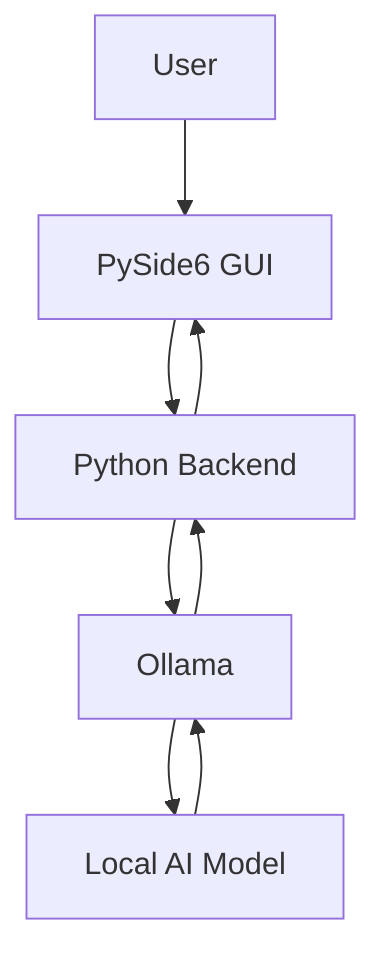
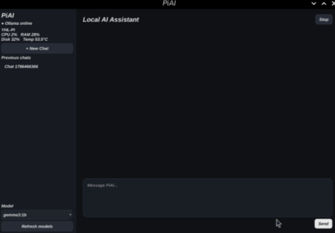
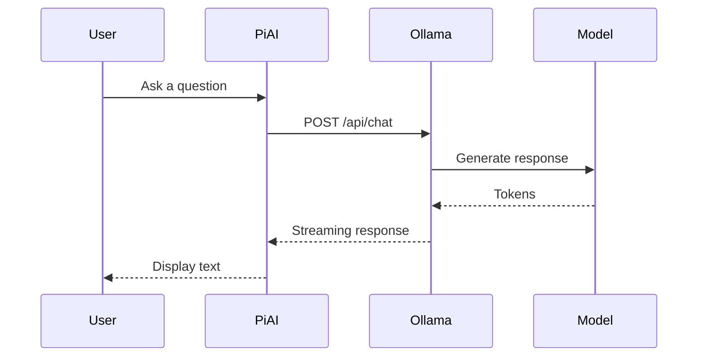
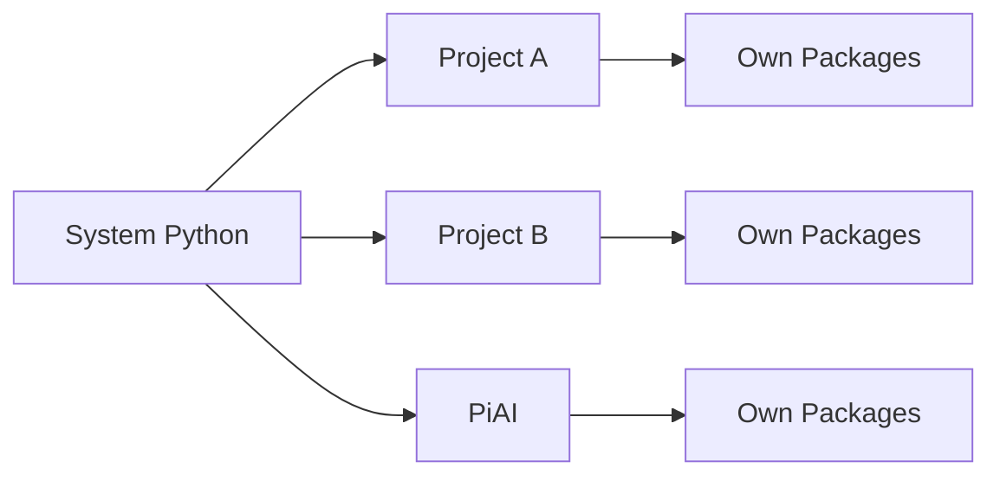
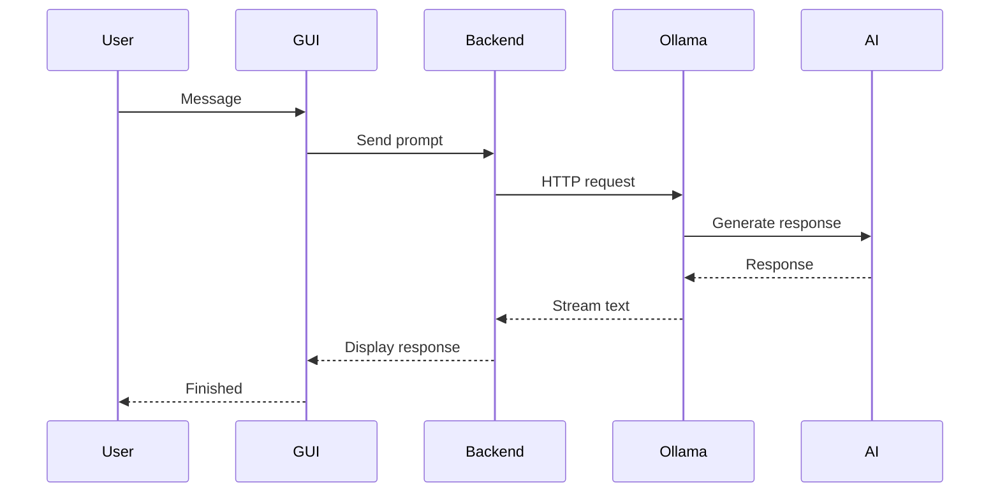

# PiAI

> **A fully local AI desktop assistant for the Raspberry Pi 5, powered by Ollama and PySide6.**

PiAI allows you to run a modern AI chatbot **entirely on your Raspberry Pi**. Once the AI model has been downloaded, all inference happens locally without requiring an internet connection.

Unlike cloud-based AI assistants, PiAI keeps your conversations on your own hardware while also providing a foundation for interacting with Raspberry Pi hardware, Docker containers, sensors, and future automation tools.

---

# Table of Contents

- [Overview](#overview)
- [How PiAI Works](#how-piai-works)
- [Prerequisites](#prerequisites)
- [Installation](#installation)
- [Running PiAI](#running-piai)
- [Project Structure](#project-structure)
- [How Everything Works Together](#how-everything-works-together)
- [Future Features](#future-features)
- [Troubleshooting](#troubleshooting)

---

# Overview

PiAI consists of four major components:



Each component has a different responsibility.

| Component | Purpose |
|-----------|---------|
| PySide6 | Desktop application |
| Python | Controls the application |
| Ollama | Runs the AI model |
| AI Model | Generates responses |

Keeping these separate makes the project easier to maintain and extend.

---

# GUI Preview

PiAI provides a simple, modern desktop interface with two main areas:

- A left sidebar for system status, model selection, and saved chats.
- A large right panel for the conversation history and message input.

The interface includes:

- `Ollama` online/offline status
- System metrics (CPU, RAM, disk, temperature)
- A model dropdown and refresh button
- A list of previous chats
- A chat transcript area with user and assistant messages
- A text input box and send button



This gives the user a clean, responsive experience for local AI conversations.

---

# Why Ollama?

Many AI models are difficult to install manually.

Ollama provides:

- Easy installation
- Automatic model management
- REST API
- Streaming responses
- Local execution

Instead of writing code to load large language models directly, PiAI communicates with Ollama through its HTTP API.



---

# Why PySide6?

There are many GUI frameworks available for Python.

| Framework | Pros | Cons |
|-----------|------|------|
| Tkinter | Built-in | Looks dated |
| PyQt | Excellent | Commercial licensing restrictions |
| **PySide6** | Modern, free, powerful | Slightly larger installation |

PySide6 provides a modern desktop experience and is well suited for larger applications.

---

# Prerequisites

## Hardware

- Raspberry Pi 5
- 8 GB RAM (recommended)
- Stable internet connection (initial setup only)

---

## Software

- Raspberry Pi OS (64-bit)
- Python 3.11+
- Git

---

# Installation

## Step 1

Update your Raspberry Pi.

```bash
sudo apt update
sudo apt upgrade -y
```

### Why?

Updating ensures all packages and system libraries are compatible with the latest versions of Python and Qt.

---

## Step 2

Install Git.

```bash
sudo apt install git -y
```

### Why?

Git allows you to clone and update the project easily.

---

## Step 3

Clone the repository.

```bash
git clone https://github.com/YOUR_USERNAME/PiAI.git

cd PiAI
```

---

## Step 4

Create a Python virtual environment.

```bash
python3 -m venv .venv
```

Activate it.

```bash
source .venv/bin/activate
```

### Why use a virtual environment?

A virtual environment isolates the project's Python packages from the operating system.

Without it:

```
System Python
        │
  Every project shares
     the same packages
```

With it:



This prevents package conflicts between projects.

---

## Step 5

Install Python dependencies.

```bash
pip install -r requirements.txt
```

These include:

- PySide6
- Requests
- psutil

---

# Installing Ollama

Download and install Ollama.

```bash
curl -fsSL https://ollama.com/install.sh | sh
```

Verify installation.

```bash
ollama --version
```

---

Start the service if necessary.

```bash
sudo systemctl enable ollama

sudo systemctl start ollama
```

Verify it is running.

```bash
systemctl status ollama
```

Expected:

```
Active: active (running)
```

---

# Downloading an AI Model

Download Gemma 3 1B.

```bash
ollama pull gemma3:1b
```

### Why Gemma 3 1B?

It provides a good balance between:

- Speed
- RAM usage
- Accuracy

for a Raspberry Pi 5.

Larger models produce better answers but generate responses more slowly.

---

List installed models.

```bash
ollama list
```

---

# Running PiAI

Start the application.

```bash
python main.py
```

You should see the main window.


---

# Sending Your First Prompt

Example:

```
Explain Docker in simple terms.
```

The workflow looks like this.



---

# Project Structure

```
PiAI/

├── main.py
├── requirements.txt
├── README.md

├── core/
│   ├── config.py
│   ├── ollama_client.py
│   ├── chat_manager.py
│   └── system_info.py

├── ui/
│   ├── main_window.py
│   └── theme.py

├── chats/

└── .venv/  # optional local Python virtual environment
```

---

# What Each File Does

- `main.py`
  - Application entry point. Starts the PySide6 QApplication and opens `MainWindow`.
- `requirements.txt`
  - Lists Python packages required to run PiAI.
- `README.md`
  - Project documentation and usage instructions.

- `core/config.py`
  - Defines constants, Ollama URL, default model, and chat storage location.
- `core/ollama_client.py`
  - Handles Ollama API calls and provides a background worker for streaming chat responses.
- `core/chat_manager.py`
  - Manages chat history, loads and saves conversations to JSON files.
- `core/system_info.py`
  - Reads host and Raspberry Pi system metrics like CPU, RAM, disk, and temperature.

- `ui/main_window.py`
  - Builds the graphical interface, manages user input, chat rendering, and worker threads.
- `ui/theme.py`
  - Contains the Qt stylesheet used by the app.

- `chats/`
  - Stores saved chat sessions as JSON files.
- `.venv/`
  - Optional local Python virtual environment for development.

---

# What Each Folder Does

## core/

Contains the application logic and behavior.

Examples:

- Talking to Ollama
- Saving chats
- Reading system information

---

## ui/

Contains everything related to the graphical interface.

Examples:

- Main window
- Sidebar
- Theme
- Buttons

---

## chats/

Stores previous conversations.

---

# Current Features

- Local AI
- Streaming responses
- Chat history
- Model selector
- Raspberry Pi monitoring
- Dark mode

---

# Planned Features

## AI

- Markdown rendering
- Code syntax highlighting
- Copy code blocks
- Vision models
- Voice assistant

## Raspberry Pi

- GPIO control
- Camera support
- HC-SR04 integration
- DHT22 integration
- Servo control
- Relay control

## Docker

- Start containers
- Stop containers
- Restart containers
- View logs

---

# Troubleshooting

## PySide6 not found

```bash
pip install -r requirements.txt
```

---

## Ollama offline

Check:

```bash
systemctl status ollama
```

Start it:

```bash
sudo systemctl start ollama
```

---

## No models found

Download one.

```bash
ollama pull gemma3:1b
```

---

## Application cannot connect to Ollama

Verify the API is reachable.

```bash
curl http://127.0.0.1:11434/api/tags
```

---

# Roadmap


---

# Author

**Leong Yu Hang**

Infocomm & Media Engineering Student

PiAI was built as a learning project to explore local AI inference, desktop application development, and Raspberry Pi integration. The long-term goal is to turn PiAI into a complete on-device AI assistant capable of controlling hardware, monitoring the operating system, and interacting with embedded projects.